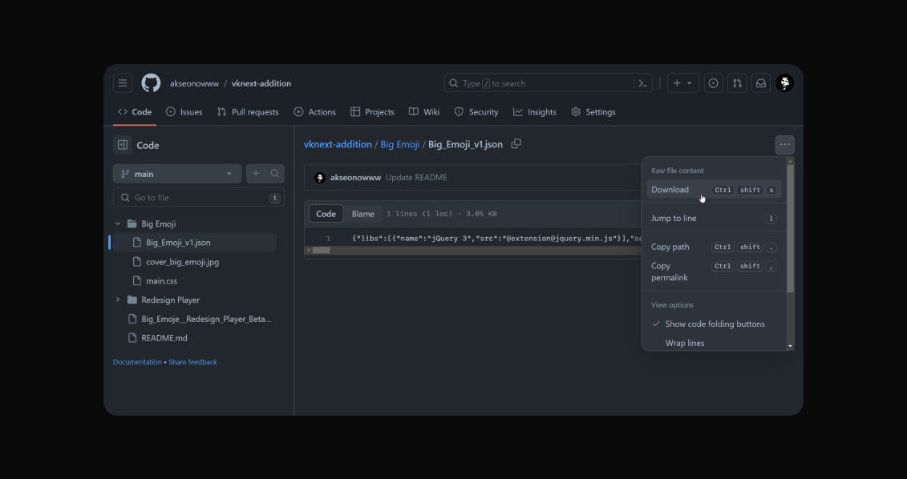
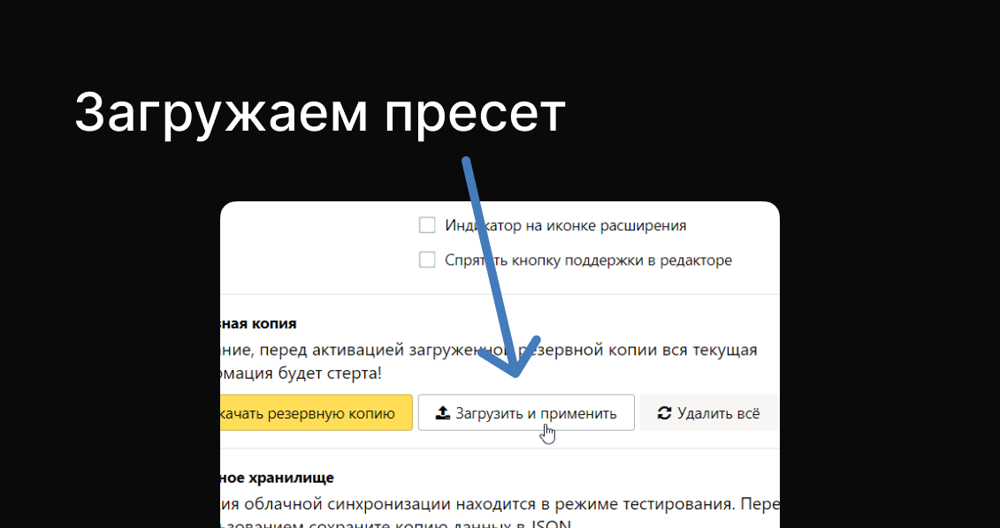

# VK Next Addition

Дополнение для расширения [VK Next](https://vknext.net/). В планах создание версий без необходимой установки VK Next, чтобы стили не конфликтовали.

## Планы дополнения

### Готово

- [x] Большие эмодзи
      
  - [x] [Инструкция по установке (Figma)](<https://www.figma.com/proto/ZYc6N8TKc3xS5Z7on0ehsI/VK-Next-(%D0%B8%D0%B4%D0%B5%D0%B8)?page-id=102%3A710&type=design&node-id=102-713&viewport=79%2C221%2C0.1&scaling=min-zoom&mode=design>)
  - [x] Оптимизировать (1 заход)
  - [x] Версия без VK Next

### В работе

- [x] Редизайн плеера (работает при включеннии `VK Next > Музыка > Другой вид аудиоплеера`)
      
  - [x] Реализовать [дизайн (Figma)](<https://www.figma.com/file/ZYc6N8TKc3xS5Z7on0ehsI/VK-Next-(%D0%B8%D0%B4%D0%B5%D0%B8)?type=design&node-id=0-1&mode=design>)
  - [ ] Исправить баги
  - [ ] Оптимизировать
  - [ ] Black List для плеера
  - [ ] Версия без VK Next

### В ожидании

- [ ] Конструктор по объединению пресетов
- [ ] Обновление старого интерфеса (модальные окна, выпадающие настройки)
- [ ] Окно с кастомитизацией пресетов VK Next Addition
- [ ] Тема Telegram Dark/Light

## Как воспользоваться?

Внимание! Разработчик не несёт отвественность за вашу безопастность. Действия далее вы совершаете на свой страх и риск.

1. Устанавливаем [VK Next](https://vknext.net/)
2. Устанавливаем [User JavaScript and CSS](https://chrome.google.com/webstore/detail/user-javascript-and-css/nbhcbdghjpllgmfilhnhkllmkecfmpld) (далее UJ&C)
3. Скачиваем пресет (нужно быть зарегистрированным на github.com):
   - [Big Emoji v1](Big%20Emoji/Big_Emoji_v1.json) (VK Next не обязателен)
   - [Redesig Player Beta v1](Redesign%20Player/Redesign_Player_Beta_v1.json)
   - [Big Emoji + Redesig Player Beta - v1](Big_Emoje__Redesign_Player_Beta__v1.json)
     
4. Заходим в настройки UJ&C
   
5. Загружаем пресет
   

## Есть идея или ошибка?

Пиши на @akseonowww:

- [Telegram](https://t.me/akseonowww)
- [VK](https://vk.com/akseonowww)
