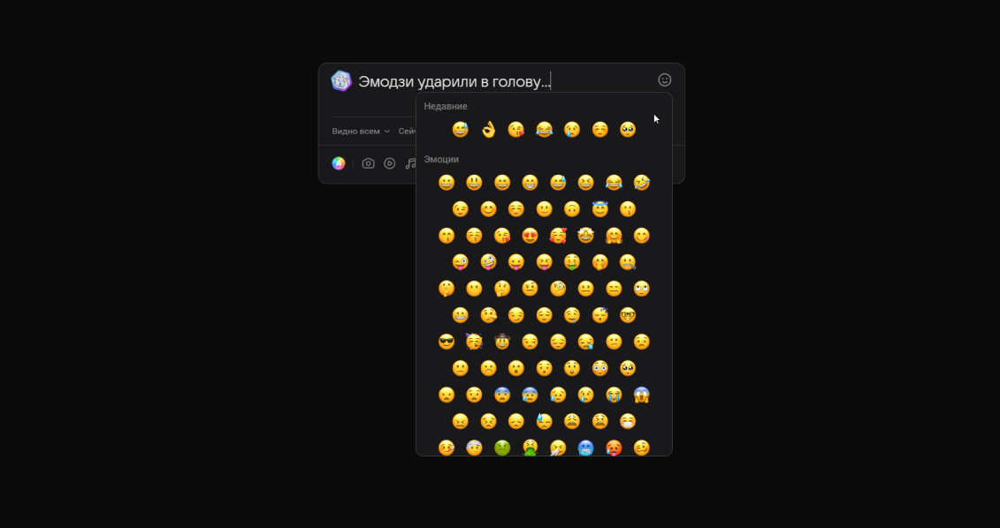
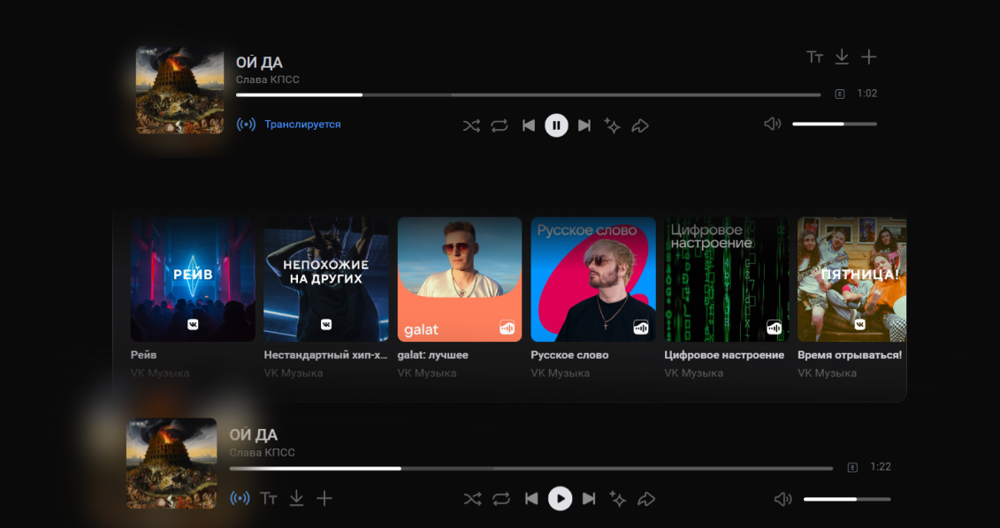

# VK Next Addition

Дополнение для расширения [VK Next](https://vknext.net/). _В планах создание версий без необходимой установки VK Next, чтобы пресеты не конфликтовали._

[Фичи](#фичи)  •  [Как воспользоваться?](#как-воспользоваться) •  [Есть идея или ошибка?](#есть-идея-или-ошибка)

## Фичи

### Готовые

- [x] Большие эмодзи (работает при включеннии `VK Next > Внешний вид > Эмодзи > Apple`)

_`Вверсия: 1.0 (лето 2023)`_ 

  - [x] [Инструкция по установке (Figma)](<https://www.figma.com/proto/ZYc6N8TKc3xS5Z7on0ehsI/VK-Next-(%D0%B8%D0%B4%D0%B5%D0%B8)?page-id=102%3A710&type=design&node-id=102-713&viewport=79%2C221%2C0.1&scaling=min-zoom&mode=design>)
  - [x] Оптимизировать (1 заход)
  - [ ] Версия без VK Next

### В разработке

- [x] Редизайн плеера (работает при включеннии `VK Next > Музыка > Другой вид аудиоплеера`)

_`Вверсия: 1.0 Beta (лето 2023)`_

_Многие ошибки решает F5_

  - [x] Реализовать [дизайн (Figma)](<https://www.figma.com/file/ZYc6N8TKc3xS5Z7on0ehsI/VK-Next-(%D0%B8%D0%B4%D0%B5%D0%B8)?type=design&node-id=0-1&mode=design>)
  - [ ] Исправить баги
  - [ ] Оптимизировать
  <!-- - [ ] Проигрышь анимации для длинных названий треков -->
  <!-- - [ ] Пауза на обложке -->
  - [ ] Версия без VK Next

### В ожидании

<!-- - [ ] Конструктор по объединению пресетов -->
<!-- - [ ] Обновление старого интерфеса (модальные окна, выпадающие настройки) -->
<!-- - [ ] Окно с кастомитизацией пресетов VK Next Addition -->
- [ ] Тёмная тема Телеграма
- [ ] Тексты с Genius (для плеера) 
- [ ] Black List (для плеера)
- [ ] Режим полного экрана проигрывающего трека 

## Как воспользоваться?

Внимание! Разработчик не несёт отвественность за вашу безопастность. Действия далее вы совершаете на свой страх и риск.

1. Устанавливаем [VK Next](https://vknext.net/)
2. Устанавливаем [User JavaScript and CSS](https://chrome.google.com/webstore/detail/user-javascript-and-css/nbhcbdghjpllgmfilhnhkllmkecfmpld) (далее UJ&C)
3. Скачиваем пресет (нужно быть зарегистрированным на [github.com](https://github.com)):
   - [Big Emoji v2](BigEmoji/BigEmoji_v2.json)
   - [Redesig Player Beta v1](RedesignPlayer/RedesignPlayer_Beta_v1.json)
   - [Big Emoji + Redesig Player Beta - v1](BigEmoje_RedesignPlayer_Beta__v1.json)
   
4. Заходим в настройки UJ&C
   
5. Загружаем пресет
   

## Есть идея или ошибка?

Пиши на @akseonowww:

- [телеграм](https://t.me/akseonowww)
- [вконтакте](https://vk.com/akseonowww)
